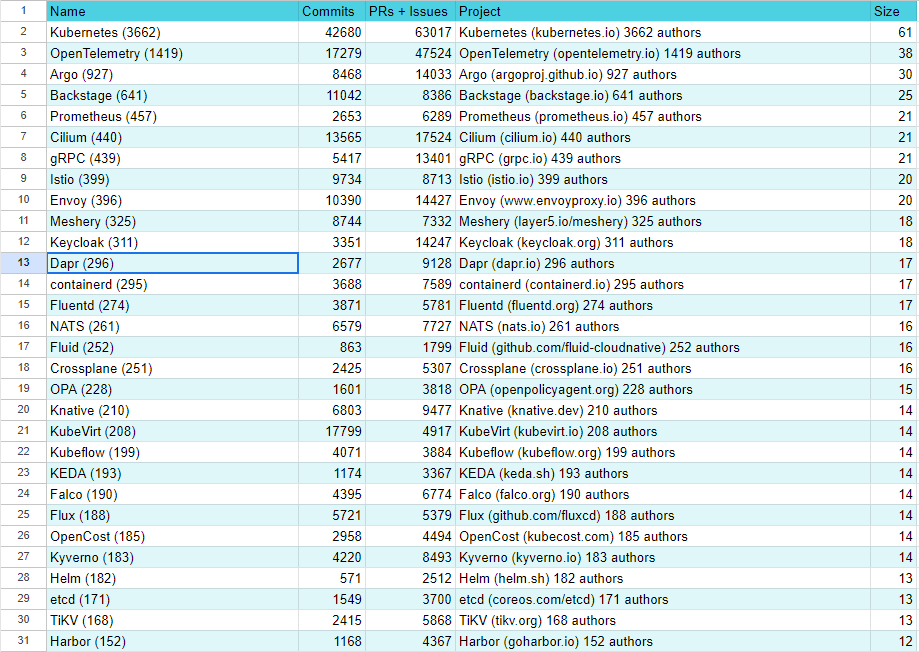
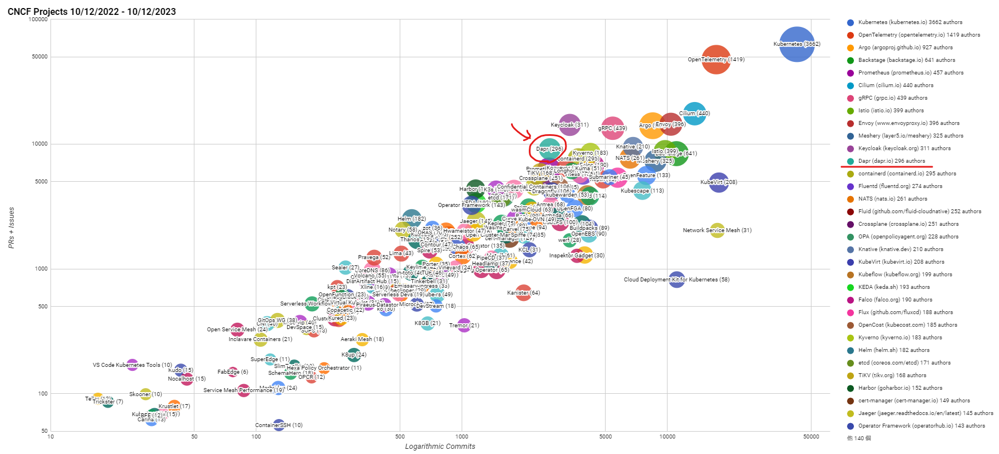
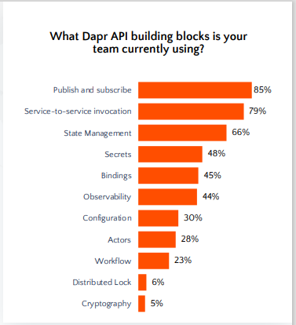
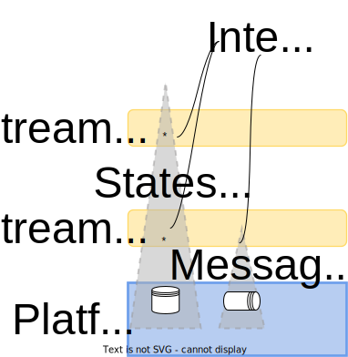

<!--
paginate: true
_backgroundColor: White
_color: Black
_class: center
-->


##### Distributed Application Runtime
## Dapr 

***quick introduction***

2024/5/25
水柿


<!--  -->

--- 

<!--
_class: toc
-->

## TOC
1. 分散アプリケーション開発の悩みどころ

2. Daprとは
   1. 主な機能の紹介
   2. WorkflowのDemo

3. Daprの使用感
4. 関連の話題

---
<!--
_class: detail
-->


#### 1. 分散アプリケーション開発の悩みどころ
##### よくある課題
- ビジネスロジックに直接関係しない開発が多い…
  - ステート管理、同期/非同期呼び出し、リトライ、サーキットブレーカー 等々…
- アプリとインフラが密に結合してしまう
  - インフラを扱うためのSDK・パッケージがコード内に入り込む

- Java(Spring)だったら、Spring Cloudを使えば多くは解決するが…
  - Javaに限定されてしまう(マイクロサービスのメリットをスポイル)
  - アプリのコードと密結合⇒コード側のライフサイクルに影響してしまう
    - 参考：[Spring CloudユーザーのためのDapr入門](https://www.youtube.com/watch?v=8qKAmFWxOh0&pp=ygULZGFwciBzcHJpbmc%3D)

---
## アプリケーションレイヤの問題を解決するための、汎用的な仕組みがあったらうれしい🥺
↓
## DAPR
#### Dapr is a portable, event-driven, runtime for building distributed applications across cloud and edge.
---
<!--
_class: center 
-->
### Daprの主要な機能


---
### 公式見ながら説明します

[コンセプト](https://dapr.io/)
[ドキュメント](https://docs.dapr.io/)

---
<!--
_class: center 
-->
### Daprプロジェクトについて

- 規模(star数、コミッタ数)は上から10~12番に位置する規模
- 2021年末にIncubationとなり、現在はGraduation申請済み
- CNCF寄贈前はMSのプロジェクト(Azure CTO室, KEDAも同じチーム)

[CNCF Survey](https://docs.google.com/spreadsheets/d/1uDIQywu3itQEkxN3rEzvJgydl1Q5gTw5YFOdSMWSc30/edit#gid=0)

---



---


---
### CNCF プロジェクトの成熟度
Graduation申請中
https://github.com/cncf/toc/pull/1168


---
### ServiceMeshとの違い


#### スコープの違い
-  ServiceMeshはアプリの安定性、トラフィックコントロール等運用者寄り
-   開発者はServiceMeshの存在をあまり意識しない(透過的なので)
-  Daprは開発よりの課題(Pub/Sub, State等々)に注目
   - Daprを使うと必然的にコードが変わる（抽象度が上がる)


---


---


---


---
### 主な機能
- Pub/Sub
- Service Invocation
- StateMnagement



[右の出典](https://22146261.fs1.hubspotusercontent-na1.net/hubfs/22146261/State%20of%20Dapr%202023%20Report.pdf?utm_campaign=State%20of%20Dapr%202023&utm_medium=email&_hsenc=p2ANqtz-_yy4QSlRVIhJ-U905gSuRYNOZ8yv5QWk8mNcd5CI3Bt8BM-B_rvcVngeL6IZKfcqK5tri2UkMPN5mPSxHRmNHqUG3eZNb0zivaSWDaziUd1Exvbqg&_hsmi=277607029&utm_content=277607029&utm_source=hs_automation)


---
### その他機能
- Binding(非DaprシステムとのIn/Out)
  - 入力(何かのイベントを契機にDaprを動かす)
  - 出力(外部リソースを呼び出す)
- 認証(リクエスト元の)
- 相互認証(Daprコンポーネント間)
- Resiliency(Retry, Circuit Breaker)
- OutBox(Event Sourcing)
- 分散ロック
- Actor
- Workflow(オーケストレーション)
- Non Dapr Endpoint呼び出し

---
### Workflowのデモ

---


---
<!--
_class: center 
-->
### workflowの考慮事項
- 各Activityは、決定論的なふるまいになるようにすること
  - なので、以下は非推奨
  - コード内でランダム文字列(UID、タイムスタンプ等)を生成・使用すること
    - これらはDaprに頼めばDapr側がやってくれる
  - 直接外部の状態を触ること
    - Dapr経由で触りましょう
- 子のスレッドを立てないこと(Dapr側が状態を追えなくなるので)
  - 似たようなことをするなら、Workflowの中で、子のWorkflowを生成しましょう
---
<!--
_class: center 
-->

## 突然ですがここでQuizの時間です

---
#### Q. Daprのトポロジ(※)として、可能なものはどれ？

1. Sidecar (アプリ・1podに対応)
2. Shared (アプリ間で共通; Istio Ambient Meshのようなもの)
3. Serverless (Daprを自前で管理しない; Dapr as a Service)

※ daprdをどう起動するかということ

---
<!--
_class: detail
-->

##### A. 全部可能！

|             Topology             |                        Pros                         |                                    Cons                                     |
| :------------------------------: | :-------------------------------------------------: | :-------------------------------------------------------------------------: |
|             Sidecar              |                        無難                         |              0スケール時に不安。k8sでSidecarは1st Ctznじゃない              |
|              Shared              |                 リソース使用少なめ                  | 急なスケールアウトに対応しにくい。落ちると影響大きい 機密情報の分離が難しい |
| Serverless(Azure Container Apps) |                     管理が簡単                      |                     強めのベンダロックイン(基本Azure内)                     |
|   Serverless(Diagrid Catalyst)   | 管理が簡単、Diagridのインフラだけでなく、自前でもOK |                            ややベンダロックイン                             |

---


---
<!--
_class: center 
-->
### Q. daprdの通信に関して、以下のうち正しい記述はどれ？

1. daprdと対応するアプリは、お互い`localhost`で繋がる必要がある
2. Sidecarのdaprdがアプリ向けに公開するポート(デフォルトでは`http:3500`,  `grpc: 50001`)は、他のアプリと重複しないよう設定する必要がある
3. アプリはdaprdを経由し、全てのComponent(StateStore, Secret等)にアクセスすることが可能であり、これを制限することはできない

---
<!--
_class: center 
-->

##### A. 1. daprdと対応するアプリは、お互い`localhost`で繋がる必要がある
#### ⇒ No！

- デフォルトでは`localhost`だが、daprd起動時にアプリのURLを指定することも可能
- 以下のようなリモート構成もとることが可能(ただし、リモート構成にするとセキュリティや疎通性の考慮事項が増えることに留意)

---
<!--
_class: center 
-->

##### A. 2. Sidecarのdaprdがアプリ向けに公開するポート(デフォルトでは`http: 3500`,  `grpc: 50001`)は、他のアプリと重複しないよう設定する必要がある
#### ⇒ No！(基本的には)

- Istioなどと同じく、アプリ間のネットワークはPodにより論理的に分離されているので、デフォルトのままで良い。
- ただし、デバッグ等でローカルで素のプロセスとして複数のdaprdを立ち上げている場合は、使用中のポートを重複して使用することはできないので、この場合は変更することが必要

---
<!--
_class: center 
-->

##### 3. アプリはdaprdを経由し、全てのComponent(StateStore, Secret等)にアクセスすることが可能であり、それを制限することはできない
#### ⇒ No！

- 各アプリに対し、参照できるComponentの設定が可能(Secretを参照できるアプリは制限する等)
- ちなみに、レートリミットやサーキットブレーカー、O11yなども同様に設定可能

---

<!--
_class: center 
-->
##### Q. 以下Componentの命名として、あまり適当ではないものはどれ？

```yaml
apiVersion: dapr.io/v1alpha1
kind: Component
metadata:
  name: <name> # ←どのように命名すべき？
spec:
  type: state.redis # ←Redisを使用したState Component
  version: v1
  metadata:
  - name: redisHost
    value: redis-master.default.svc.cluster.local:6379
  - name: redisPassword
    secretKeyRef:
      name: redis-secret
      key: password
  - name: actorStateStore
    value: "true"
```
1. `state`
2. `state-redis`
3. `state-{env}` (`state-dev`, `state-stg`, `state-prd`など)
4. `state-actor`

---
#### A. 2. `state-redis` はおすすめしません！
   
- 理由
  - ServiceMeshは基本的にアプリケーションのコードに影響を与えない
  - Daprはコードに変更が生じる（実装固有のSDKを除外するなど）
    - (コード内ににComponentの名称が出てくる)
  - State管理の実装が`redis`かどうかは、一般にアプリレイヤにおいてはあまり関心がないので、抽象化しておいてよい

###### ※Componentの名称は、アプリ開発チームとインフラ・プラットフォーム提供チームとをつなぐキーになる要素なので、共通で握っておく必要あり。ちなみに、このyamlのファイル名には`redis`という単語が含まれていても困らない(アプリ側から特に参照しないので、インフラ側の都合で命名して良い)。


---
### TeamTopology

- インフラ・プラットフォーム提供チーム
  - APIとしてアプリ開発に必要な機能を`提供`
- アプリ開発者チーム(ストリームアラインドチーム)
  - 上記機能を`消費`

---
<!--
_class: center 
-->

## Daprを使ってみての感想
- Pros
  - 生産性が上がった！
    - Dapr習得のコスト << (ちゃんとした)分散システム開発のコスト
    - NoSQLのキーやキューの設計もデフォルトである程度形になるので、手が動かしやすい
  - ローカルと稼働環境の差分を減らせるので、開発しやすい
  - インフラの構成決定を後回しにできる
  - コミュニティに活気がある
  - 拡張性がある(Wasmと相性が良い)
---
- Cons
  - パフォーマンスの劣化はある(https://docs.dapr.io/operations/performance-and-scalability/)


---
  - 一部機能が足りない・弱い
    - 例えば、SQLへの対応が弱い
      - 簡単なステート保管は対応済み(statestore) 
      - 一般的なクエリの発行も対応はするものの(binding)、生SQLなのでPosgre、MySQL、Oracle等の差は意識しないといけない
        - 今後のロードマップに入っている
      - トランザクションは、分散ロック機能、StateのOutBox機能によるEvent Souecing、WorkflowによるSAGAの実装などで対応するのが本流か
    - 機能フラグ、契約テストなどの提供予定はない

---
### その他少しマニアックな話題
1. Daprでリモートデバッグ
2. WasmでDaprの機能を拡張する方法
3. Daggerによる効率的なCI (CIのInner Roop)
4. Crossplaneによるインフラの抽象化
5. モジュラーモノリスを目指すServiceWeaver
6. OpenFunction(Dapr + KEDA + Knative +...) 
8. Radius(認証ではない、インフラ抽象化OSS)

---

### Daprでリモートデバッグ
- マイクロサービスの数が増えてくると、一台の端末ですべてのアプリを立ち上げるのは難しくなってくる
- また、一般にリモートの環境のほうが、使用するデータの質が本番に近い
- そこでリモートデバッグ
  - ローカルでアプリのデバッグをしつつ、リモートのk8s上の同アプリへの通信をローカルに振り向けることができる

[Bridge to Kubernetes](https://marketplace.visualstudio.com/items?itemName=mindaro.mindaro)
※MSのプロプライエタリなので、VSCode固有の拡張機能
※OSSのTerepresenceでも同様の開発が可能だが、そちらは使用できないとの情報をどこかで見かけた記憶あり


---
#### Ref
- Platform Engineering on Kubernetes


